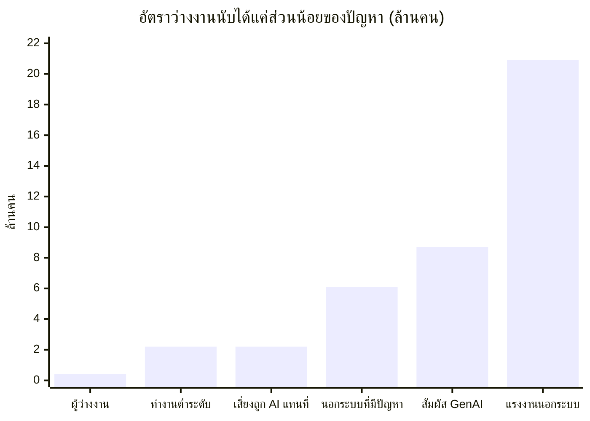
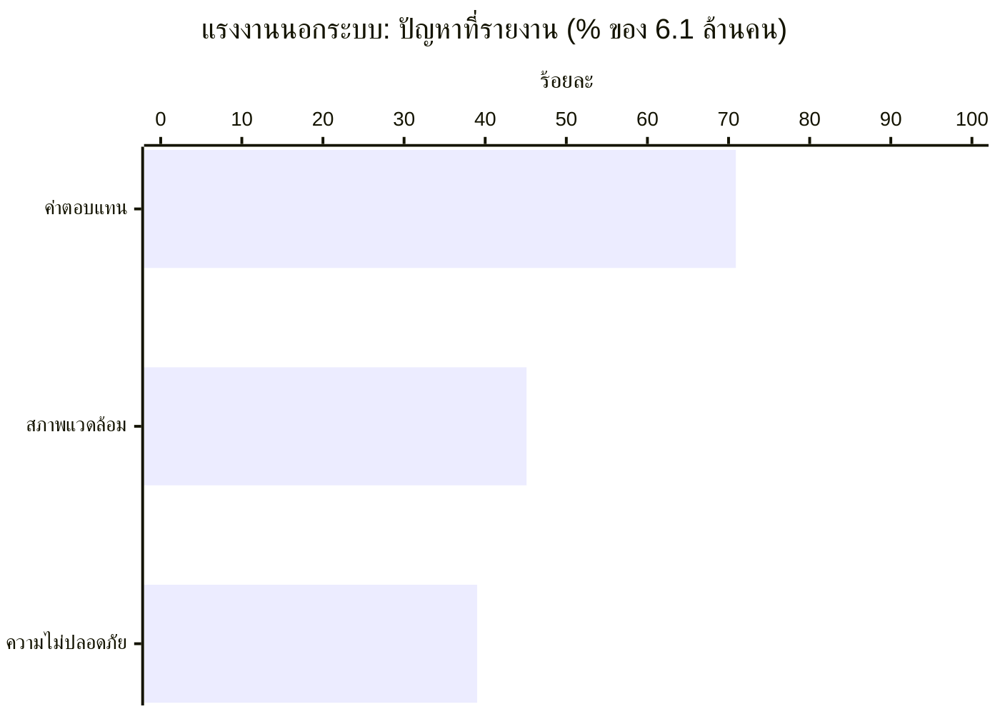
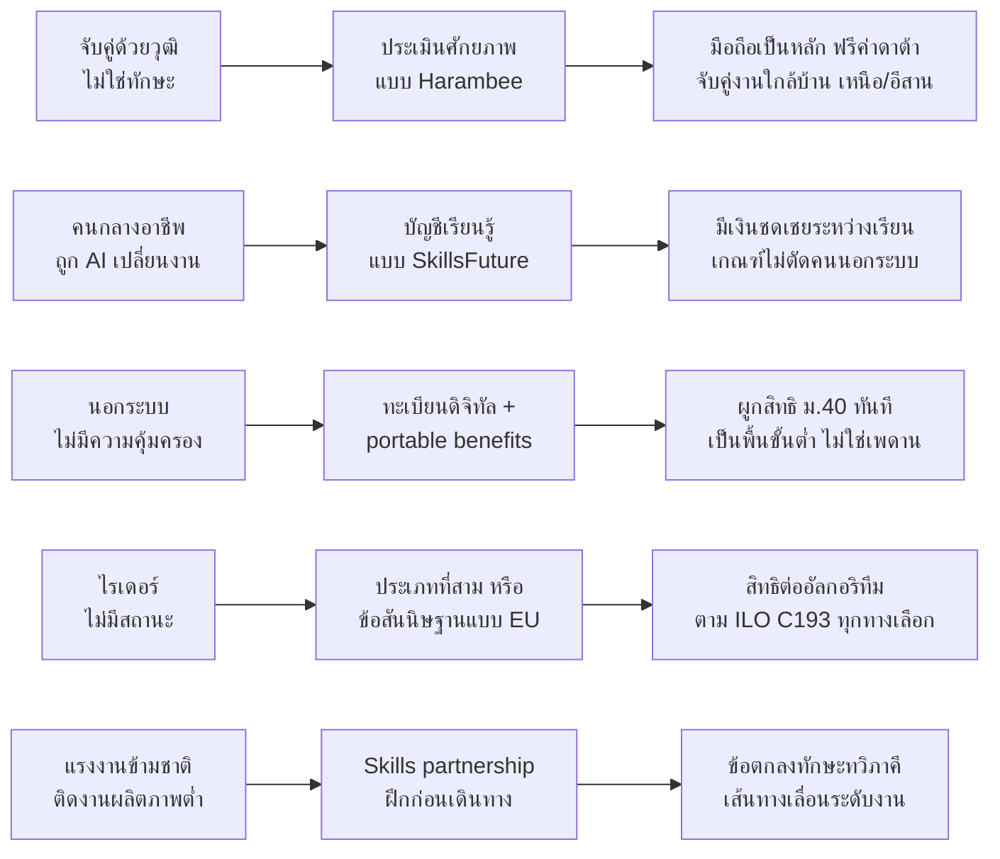

# open-th-labor: ช่องว่างระหว่างคนกับงาน ตลาดแรงงานไทยเทียบโลก 2026

คำตอบของคำถามวิจัย 4 ข้อ สรุปจากรายงาน [สภาพตลาดแรงงานไทยและโลก 2026](report-2026.md) (@Digital WRS, 5 ต.ค. 2026)

- **เว็บแบบ interactive (GitHub Pages):** [`index.html`](index.html) มีกราฟ 12 ชุด, tooltip, ตารางข้อมูลใต้ทุกกราฟ และรองรับ dark mode
- **ไฟล์นี้:** กราฟ Mermaid ที่แสดงผลบน github.com ได้ทันที

> ตัวเลขทุกตัวมาจากรายงาน ยกเว้น "ระดับหลักฐาน" ในตารางนวัตกรรม ซึ่งผู้จัดทำจัดกลุ่มเองจากตัวเลขในรายงาน

## ตัวชี้วัดหลักของไทย

| อัตราว่างงาน Q2/2569 | ผู้ทำงานต่ำระดับ | ค่าจ้างที่แท้จริง | แรงงานนอกระบบ | สัมผัส GenAI |
| :-: | :-: | :-: | :-: | :-: |
| **0.95%** (Q2/2568: 0.91%) | **2.2 ล้านคน** (+8%) | **−2.88%** (OECD +2.2%) | **52.4%** (20.9 ล้านคน) | **8.7 ล้านคน** |

---

## 1. ตลาดแรงงานไทยมีปัญหาเชิงโครงสร้างอะไร และเหมือนหรือต่างจากโลกอย่างไร

**คำตอบ:** ไทยมีปัญหาซ้อนกันสี่ชั้นเหมือนโลก (อุปทาน อุปสงค์ กลไกจับคู่ การคุ้มครอง) แต่หนักกว่าในสองเรื่อง คือ **"แก่ก่อนรวย"** และ **แรงงานนอกระบบเกินครึ่ง**

| ชั้น | ไทย | เทียบโลก |
| --- | --- | --- |
| อุปทาน | วัยแรงงานคาดลด 43.2 → 36.5 ล้านคน (2563→2583); 64.7% ต่ำกว่าเกณฑ์การอ่าน, 74.1% ขาดทักษะดิจิทัล | ทักษะ ~39% ต้องเปลี่ยนภายใน 2030 |
| อุปสงค์ | โรงงานปิด 156 > เปิด 139 แห่ง (Q1/2569); 8.7 ล้านคนสัมผัส GenAI, 2.2 ล้านเสี่ยงถูกแทนที่ | งาน 25% สัมผัส GenAI |
| รายได้ | ค่าจ้างจริง −2.88%; หนี้ครัวเรือน 85.9% ของ GDP | OECD ค่าจ้างจริง +2.2% |
| การคุ้มครอง | นอกระบบ 52.4%; ไรเดอร์ยังไม่ใช่ลูกจ้าง | นอกระบบ 2.1 พันล้านคน; ILO รับรอง C193 |

**จุดต่างสำคัญ:** อัตราว่างงานไทย 0.95% ต่ำกว่าโลก 4.9% มาก เพราะคนตกงานไหลกลับภาคเกษตรและงานนอกระบบ ตัวเลขนี้จึงซ่อนปัญหา ตัวชี้วัดที่สะท้อนจริงกว่าคือการทำงานต่ำระดับ ค่าจ้างจริง และอัตราว่างงานในระบบประกันสังคม

กลุ่มอาจซ้อนกัน ห้ามนำมารวมกัน · ที่มา: สศช. Q2/2569, สสช. 2568

## 2. ผู้มีส่วนได้ส่วนเสียแต่ละกลุ่มเจอปัญหาอะไรในชีวิตจริง

**คำตอบ:** ทุกกลุ่มเจอปัญหาเดียวกันในคนละรูป คือ **ข้อมูลไม่พอ** และ **อำนาจต่อรองไม่เท่ากัน**

| กลุ่ม | ตัวเลขสำคัญ | ปัญหาหลัก |
| --- | --- | --- |
| แรงงานนอกระบบ | 20.9 ล้านคน; 6.1 ล้านรายงานปัญหา | ค่าตอบแทนต่ำ จ่ายช้า ไม่มีสวัสดิการ |
| คนเพิ่งจบ | ว่างงาน 1.70% สูงสุดทุกระดับ | หางานแรกยาก ทักษะไม่ตรง |
| คนถูกเลิกจ้าง | 2.9 แสนคนขอรับประโยชน์ว่างงาน | ทักษะเดิมใช้ไม่ได้ ไหลลงงานรายได้ต่ำ |
| ผู้สูงอายุที่ยังทำงาน | >80% ต่ำกว่าเกณฑ์ดิจิทัล | รายได้ไม่พอ ขาดงานที่เหมาะกับวัย |
| ไรเดอร์ | ต้นทุน 6.69 vs ค่ารอบ ~3.70 บาท/กม. | ถูกระงับบัญชีโดยอัลกอริทึม ไม่อยู่ใน ม.33 |
| แรงงานข้ามชาติ | 3.1 ล้านคนที่ถูกกฎหมาย | ค่าธรรมเนียมเกินกฎหมาย สถานะผูกมติ ครม. |
| นายจ้าง / SME | 71% หาคนยาก | หาคนทักษะตรงไม่ได้ แข่งสินค้าจีน |
| สถาบันการศึกษา | ผู้เรียน STEM น้อย | หลักสูตรตามตลาดไม่ทัน |
| รัฐ | ร่าง พ.ร.บ.แพลตฟอร์มยังไม่ผ่าน | ข้อมูลกระจาย ตัวเลขไม่สะท้อนปัญหา |

## 3. นวัตกรรมใดกำลังแก้ปัญหา และมีหลักฐานผลลัพธ์มากน้อยแค่ไหน

**คำตอบ:** สิ่งที่ได้ผลชัดที่สุดคือการ **เปลี่ยน "หน่วย" ของระบบ** จากวุฒิเป็นทักษะที่พิสูจน์ได้ จากสถานะลูกจ้างเป็นตัวคนทำงาน และจากการศึกษาครั้งเดียวเป็นบัญชีเรียนรู้ตลอดชีวิตพร้อมเงินชดเชยรายได้

| นวัตกรรม | หลักฐานสำคัญ | ระดับหลักฐาน* |
| --- | --- | :-: |
| Harambee / SA Youth (แอฟริกาใต้) | โอกาสหารายได้ 1.4 ล้านครั้ง จากผู้หางาน 4.5 ล้านคน รัฐรับเป็นระบบชาติ | ●●● แข็ง |
| Skills partnership แรงงาน CLM | ผ่านการฝึก <20% → 55%; ทักษะไม่ตรง 70% → 40% | ●●● แข็ง |
| SkillsFuture Level-Up (สิงคโปร์) | ได้งานใน 6 เดือน 55%; คำขอเงินช่วยถูกปฏิเสธ ~60% | ●●○ ปานกลาง |
| e-Shram (อินเดีย) | ลงทะเบียน 318.9 ล้านคน แต่ "นับได้แต่ยังไม่ได้สิทธิ" | ●●○ ปานกลาง |
| Skills-based hiring (สหรัฐฯ) | ใช้ 70% แต่คนไม่มีปริญญาได้งานเพิ่มแค่ 3.5 จุด | ●○○ อ่อน |
| สถานะแรงงานแพลตฟอร์ม (สิงคโปร์ / EU / ILO C193) | กฎหมายเพิ่งบังคับใช้ ยังไม่มีข้อมูลผลลัพธ์ | ●○○ อ่อน |
| Portable benefits (4 รัฐในสหรัฐฯ) | โครงการนำร่อง DoorDash สมทบ 4% | ●○○ อ่อน |
| ขยายอายุเกษียณ (สิงคโปร์ 64/69) | เริ่ม 1 ก.ค. 2026 ยังไม่มีผลประเมิน | ●○○ อ่อน |

*ผู้จัดทำจัดระดับจากตัวเลขในรายงาน

## 4. นวัตกรรมใดนำมาใช้ในไทยได้ และต้องปรับอะไร

**คำตอบ:** ไทยมีชิ้นส่วนหลายชิ้นแล้ว แต่ **ทุกชิ้นยังผูกกับวุฒิการศึกษาหรือสถานะลูกจ้าง** จึงเข้าไม่ถึงแรงงานนอกระบบ คนต่างจังหวัด และคนที่มีทักษะแต่ไม่มีใบรับรอง

**ช่องว่างร่วมสามข้อ**

1. **ไม่มีชั้นทักษะที่เชื่อถือได้** — "ไทยมีงานทำ" ยังจับคู่ด้วยวุฒิ ประเภทงาน และจังหวัด
2. **ความคุ้มครองผูกกับสถานะลูกจ้าง** — กองทุนสงเคราะห์ลูกจ้างครอบคลุม 5.7 ล้านคน ขณะที่นอกระบบมี 20.9 ล้านคน
3. **ข้อมูลแรงงานไม่เชื่อมกัน** — จัดหางาน ฝีมือแรงงาน ประกันสังคม ใช้รหัสอาชีพและทักษะคนละชุด

## โจทย์วิจัยย่อย (เรียงตามความสำคัญ)

1. ดัชนีการใช้แรงงานไม่เต็มศักยภาพรายจังหวัด → **ทำแล้ว:** [`q1-underutilization.html`](q1-underutilization.html)
2. ชั้นยืนยันทักษะสำหรับคนไม่มีใบรับรอง (RCT)
3. AI กับงานระดับเริ่มต้นของไทย (อายุ 22–25)
4. การจับคู่งานเชิงพื้นที่ในเหนือและอีสาน
5. ทางเลือกความคุ้มครองแรงงานแพลตฟอร์ม → **ทำแล้ว:** [`q5-platform-riders.html`](q5-platform-riders.html)
6. บัญชีเรียนรู้ที่แรงงานนอกระบบใช้ได้จริง
7. มาตรฐานข้อมูลอาชีพและทักษะร่วม (ESCO / O\*NET)
8. Skills partnership กับประเทศเพื่อนบ้าน

### บันทึกการวิจัยโจทย์ย่อย (5 บท ข้ามบทที่ 3 วิธีดำเนินการวิจัย)

แต่ละโจทย์เป็นไฟล์ HTML ไฟล์เดียว รวมบันทึก 5 บทกับภาพข้อมูลไว้ด้วยกัน มี tooltip ตารางข้อมูลใต้กราฟ และ dark mode

| ไฟล์ | โจทย์ | ข้อค้นพบหลัก |
| --- | --- | --- |
| [`q1-underutilization.html`](q1-underutilization.html) | ดัชนีการใช้แรงงานไม่เต็มศักยภาพรายจังหวัด (ธีมภูเขาน้ำแข็ง) | อัตราว่างงาน 0.95% ซ่อนปัญหาไว้ 2–7 เท่า (1.94%–6.8%) และ 9 ใน 10 จังหวัดที่อัตราว่างงานสูงสุดไม่ติด 10 อันดับแรกของดัชนี มี 6 จังหวัดที่ติดอันดับในทั้งสองดัชนี ได้แก่ นครพนม สุรินทร์ ยโสธร บุรีรัมย์ กาฬสินธุ์ และพิจิตร |
| [`q5-platform-riders.html`](q5-platform-riders.html) | ทางเลือกความคุ้มครองไรเดอร์ (ธีมถนน พร้อมแบบจำลองที่ปรับค่าได้) | ประกันอุบัติเหตุจากงานรวมกับบัญชีติดตัวมีต้นทุนราว 1.9 บาท/ออร์เดอร์ งานหายผ่านการคัดคนออกมากกว่าผ่านราคา และต้นทุนต่อ กม. กระทบรายได้สุทธิมากกว่าการเลือกรูปแบบความคุ้มครอง |

> ข้อแก้ไขจากรายงานต้นทาง: ตัวเลข 2.2 ล้านคนคือ "ผู้เสมือนว่างงาน" ของ สศช. ส่วนผู้ทำงานต่ำระดับที่อยากทำงานเพิ่มจริงมี 0.17–0.19 ล้านคน และตัวเลข 6.69 บาท/กม. มาจากข้อพิพาทของไรเดอร์ Lalamove ซึ่งส่งพัสดุ ไม่ใช่ไรเดอร์ส่งอาหาร

## เปิดเว็บด้วย GitHub Pages

Settings → Pages → Build and deployment → Source: **Deploy from a branch** → เลือก branch นี้และโฟลเดอร์ `/ (root)` แล้วเว็บจะอยู่ที่ `https://simplewishth.github.io/open-th-labor/`

| ไฟล์ | เนื้อหา |
| --- | --- |
| `index.html` | เว็บ interactive ไฟล์เดียว ไม่ต้อง build |
| `q1-underutilization.html` | บันทึกวิจัยโจทย์ย่อยที่ 1 พร้อมภาพข้อมูล |
| `q5-platform-riders.html` | บันทึกวิจัยโจทย์ย่อยที่ 5 พร้อมแบบจำลอง |
| `report-2026.md` | รายงานฉบับเต็มพร้อมลิงก์แหล่งข้อมูล |
| `.nojekyll` | ให้ Pages เสิร์ฟไฟล์ตรง ๆ ไม่ผ่าน Jekyll |
